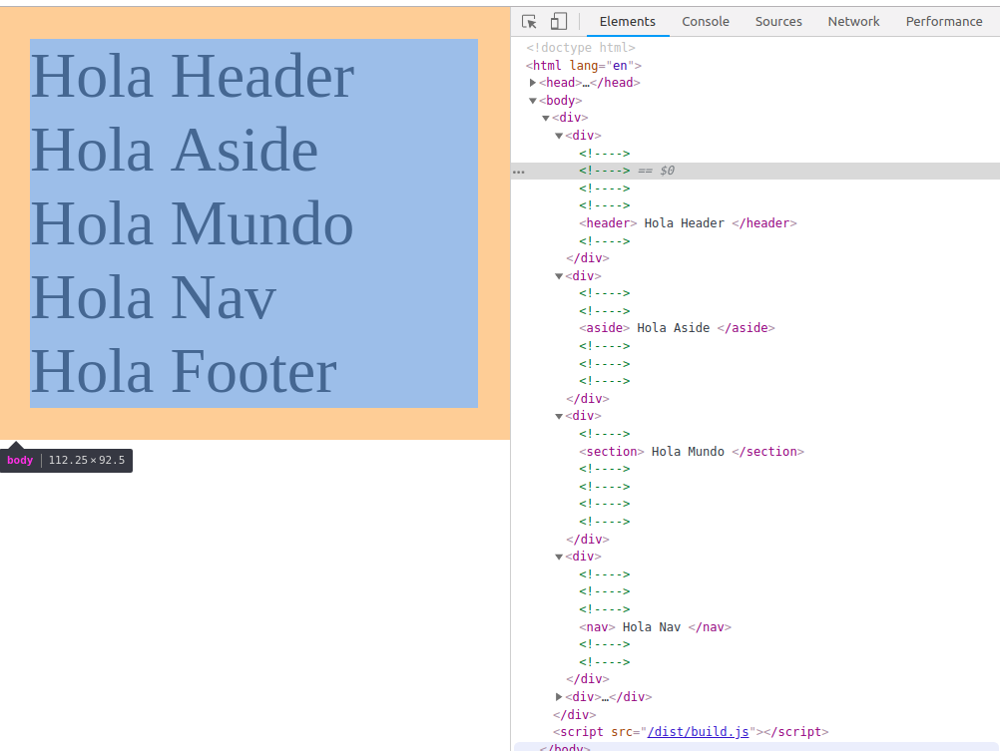
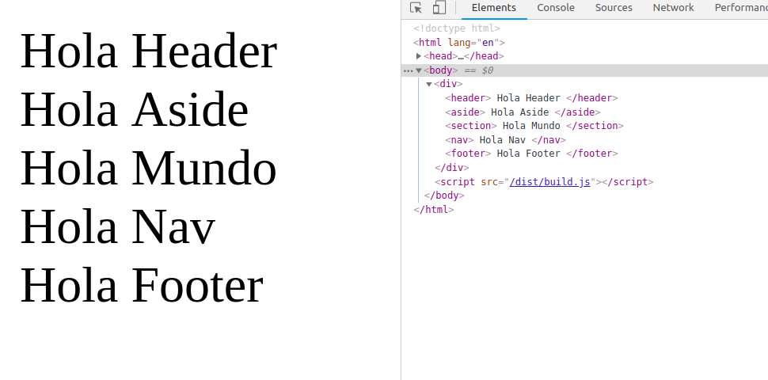

# Render Function:

En el archivo *main.js* tenemos la función render:
```javascript
  import Vue from 'vue'
  import App from './App.vue'

  new Vue({
    el: '#app',
    render: h => h(App)
  })
```
Vamos a ver que es lo que está haciendo esta función que se llama a sí misma en el método render de la instancia Vue principal, y que tiene como parámetro App.

Hasta ahora cuando queríamos renderizar algo en nuestra app, dentro de la instancia de Vue lo que hacíamos era definir un template:
```javascript
import Vue from 'vue';
import App from './App.vue';

new Vue {
  el: '#app',
  template: '<template a pintar>'
}
```
El nombre sigue estando dentro de la propiedad *el:* de la instancia, pero en ved de template ahora tenemos una función render. En la [documentación de Vue sobre el tema](https://vuejs.org/v2/guide/render-function.html#ad), podemos leer lo siguiente:

>"Vue recomienda utilizar plantillas para construir su HTML en la gran mayoría de los casos. Sin embargo, hay situaciones en las que realmente es necesaria todo el poder programático de JavaScript. Ahí es donde se puede usar la función de procesamiento (render), una alternativa más cercana al compilador para las plantillas."

En resumen, usar las templates (que son strings en realidad) para la representación del DOM, pero que hay casos en los que es mejor componer los templates programáticamente.

De esta forma se puede decidir que elementos se muestran, acceder a sus porpiedades y crear ese template.

## Demo:

Vamos a crear un componente llamado Elemento, para ver como funciona la función render.

Vaciamos el contenido de App.vue para dejarlo con lo mínimo necesario:
```html
<template>
</template>

<script>
export default {
  
}
</script>

<style>
</style>
```
Como vamos a crear un componente llamado Elemento, podemos invocarlo dentro del template con su directiva \<elemento>\</elemento>. A este componente le vamos a pasar una propiedad llamada *tipo* el tipo de elemento del DOM que va a ser, por ejemplo un *aside*:
```html
<template>
  <elemento tipo="aside"> Hola mundo </elemento>
</template>

<script>
export default {
  
}
</script>

<style>
</style
```
Si bien dentro de la propiedad *tipo* podemos pasarle el valor que queramos para que renderice un elemento de HTML en el DOM, el que deseemos.

Lo primero es crear la carpeta components dentro de la carpeta src del proyecto y ahí un nuevo archivo para nuestro componente, con lo básico.
```html
<template>
  
</template>

<script>
export default {
  
}
</script>

<style>
</style>
```
Ahora vamos a definir el template de nuestro elemento dentro de App.js con su propiedad *tipo* para que lo inserte donde deseamos, de momento se deja comentado y es el único elemento dentro de App.js, por lo que es root y no necesita de un wrapper:
```html 
<!-- En App.js ponemos: -->
<template>
  <elemento tipo="section"> Hola Mundo </elemento>
</template>
```
Como hemos pasado la propiedad *tipo*  en App.js, ya sabemos que dentro de la lógica de nuestro nuevo componente, hay una propiedad llamada así, así que la definimos con props en el export de Elemento.js:
```html
<script>
  export default {
    props: ['tipo'],
  }
</script>
```
Vamos a ver el template en el componente, podríamos poner un section con su slot para capturar lo que se pone dentro del componente en App.js (en este caso Hola Mundo). 
```html
<template>
  <div>
      <article v-if="tipo === 'article'">
        <slot><slot>
      </article>
  </div>
</template>
```
De esta forma si en App.js le decimos que la propiedad *tipo* es aside, renderiza el componente y si no, no lo hace. 

Pensemos que además queremos renderizar otros elementos dentro de Elemento.vue, podríamos pensar que símplemente se definen y lo tenemos listo, y de hecho esto funciona sin problema, aunque tiene un pero veamos que funciona:
```html
<!-- Dentro de Elemento.vue -->
<template>
  <div>

      <article v-if="tipo === 'article'">
        <slot></slot>
      </article>
      <section v-if="tipo === 'section'">
        <slot></slot>
      </section>
      <aside v-if="tipo === 'aside'">
        <slot></slot>
      </aside>
      <nav v-if="tipo === 'nav'">
        <slot></slot>
      </nav>
      <header v-if="tipo === 'header'">
        <slot></slot>
      </header>
      <footer v-if="tipo === 'footer'">
        <slot></slot>
      </footer>
  </div>
</template>
```
Vamos a importar nuestro elemento en App.js para ver como se ve:
```html
<template>
  <elemento tipo="section"> Hola Mundo </elemento>
</template>

<script>
import elemento from './components/Elemento.vue';
export default {
  components: {
    elemento,
  }
}
</script>

<style>
</style>
```
De esta forma si cambiamos la propiedad *tipo* de la plantilla del elemento, cambiará el tag renderizado en el DOM. Incluso podemos poner varios elementos con diferentes *tipo*:
```html
<!-- En App.js -->
<template>
  <div>
      <elemento tipo="header"> Hola Header </elemento>
      <elemento tipo="aside"> Hola Aside </elemento>
      <elemento tipo="section"> Hola Mundo </elemento>
      <elemento tipo="nav"> Hola Nav </elemento>
      <elemento tipo="footer"> Hola Footer </elemento>
  </div>
</template>

```
nos da como resultado esto:

Como podemos ver en las dev tools, cada componente elemento se renderiza con su tag correspondiente según el tipo definido. 


Peeeero, nuestro componente, tiene ya a simple vista un problema, es un poco repetitivo, y cuando algo se repite mucho JS siempre tiene una solución para ello. Aquí es donde se ve esa **solución programática** de la que se hablaba.

¿Cómo solucionamos esto? Pues existe un método llamado **createElement**, que es una función que se pasa como parámetro a *render* y que se le pasa un tipo de elemnto con diferentes parámetros, con un contexto y acceso a las propiedades especificadas en la instancia (como los slots), y que devuelve elementos del DOM.  
En resumen, que precisamente hace eso, crear elementos. 

Es la forma programática de pasar la información que pasábamos antes con strings.

Vamos a ver como utilizarlo. En la lógica de nuestro componente, podemos comentar el template completamente porque vamos a dejar de usarlo al utilizar la función render. 

Hay que poner la funcion render a la que se le pasa como parámetro *createElement*, y esto retorna createElement, con las propiedades que definen el tipo y el slot (que como no tiene nombre puede accederse desde el scope global de slot con *$slots*). Queda de esta forma;
```html
<!--
<template>
  <div>

      <article v-if="tipo === 'article'">
        <slot></slot>
      </article>
      <section v-if="tipo === 'section'">
        <slot></slot>
      </section>
      <aside v-if="tipo === 'aside'">
        <slot></slot>
      </aside>
      <nav v-if="tipo === 'nav'">
        <slot></slot>
      </nav>
      <header v-if="tipo === 'header'">
        <slot></slot>
      </header>
      <footer v-if="tipo === 'footer'">
        <slot></slot>
      </footer>
  </div>
</template>
-->
<script>
export default {
  props: ['tipo'],
  render( createElement) {
    return createElement(
      this.tipo, // Porque nuestra props se llama tipo.
      this.$slots.default //accede a lo que pongo en la instancia del elemento en App.js
    )
  },
}
</script>
<style>
</style>
```
Y en nuestro html generado podemos ver en las dev tools que ya no aparecen instancias comentadas y múltiples divs que se crean según coincide el tipo o no con el tag, quedando mucho más limpio:

