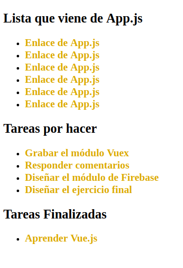
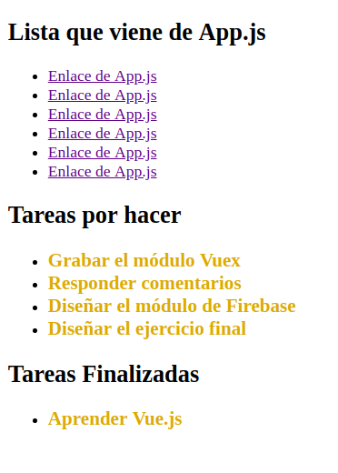

# Scoped CSS:

Si pensamos en el ámbito (scope) de las variables en JavaScript, es bastante sencillo entender que significa el scope de CSS en Vue.

Si aplicamos una serie de estilos en un componente sin más, estos estilos se aplican a lo largo de toda nuestra aplicación. Esto no sucede si en el estilo le indicamos que es *scoped*, es decir, que ha de mantenerse encapsulado dentro de ese componente y tan solo se ha de aplicar a él. 

Vamos a ver cómo y por qué es así con un ejemplo sencillo.
NOTA: En este caso y para no repetir código inecesariamente, se continúa con el ejemplo de código anterior "28_Hot_Module_Reloading"..Acudir a esa carpeta para verlo.

### Componente sin scope y con scope en el CSS:

Partiendo del código anterior, imaginemos que dentro de App.js, tenemos una lista de enlaces de esta forma:
```html
<template>
  <div>
    <h2> Lista que viene de App.js</h2>
    <ul>
      <li><a href="#">Enlace de App.js</a></li>
      <li><a href="#">Enlace de App.js</a></li>
      <li><a href="#">Enlace de App.js</a></li>
      <li><a href="#">Enlace de App.js</a></li>
      <li><a href="#">Enlace de App.js</a></li>
      <li><a href="#">Enlace de App.js</a></li>
    </ul>

    <tareas></tareas>
  </div>
</template>

<script>
  import Tareas from './components/Tareas.vue';
  
  export default {
    components: {
      Tareas
    },
  }
</script>

<style>
</style>
```
Se aprecia al ejecutar la app que todos los enlaces tienen el mismo estilo, Este estilo viene en realidad del componente, al que se le aplicaron estilos en el ejercicio anterior. Si vemos el código del componente, podemos ver que en la sección \<style>\</style> se aplica estilo a los enlaces:
```html
<template>
  <div>
    <h2> Tareas por hacer </h2>
    <ul>
      <li v-bind:key="tarea" v-for="tarea in tareasPendientes"> 
        <!-- v-bind:key="tarea" es agregado para solucionar error en linter -->
        <a href="#" @click="actualizarTarea(tarea)" v-text="tarea.nombre"></a>
      </li>
    </ul>
    <h2> Tareas Finalizadas </h2>
      <ul>
        <li v-bind:key="tarea" v-for="tarea in tareasFinalizadas">
          <a href="#" @click="actualizarTarea(tarea)" v-text="tarea.nombre"></a>
        </li>
      </ul>
    
  </div>
</template>

<script>
export default {

  data() {
    return {
      tareas: [
        {nombre:'Aprender Vue.js' , completado: true},
        {nombre: 'Grabar el módulo Vuex', completado: false},
        {nombre: 'Responder comentarios', completado: false},
        {nombre: 'Diseñar el módulo de Firebase', completado: false},
        {nombre: 'Diseñar el ejercicio final', completado: false},
      ],
      finalizadas: [],
    }
  },

  methods: {
    actualizarTarea(tarea) {
      tarea.completado = !tarea.completado;
    }
  },

  computed: {
    tareasPendientes() {
      return this.tareas.filter((tarea) => !tarea.completado);
    },
    tareasFinalizadas(){
      return this.tareas.filter((tarea) => tarea.completado);
    }
  }
}
</script>

<style>
  li a {
    color:goldenrod;
    font-size: 1.2em;
    font-weight: bold;
    text-decoration: none;
  }
</style>
```
El resultado en navegador es este:



Puede ser que en un momento dado nos interese aplicar el estilo de un componente en toda la aplicación, pero por norma general no será así y de echo esto choca un poco con la idea de encapsulamiento que se lleva a cabo con los componentes. 

Para evitar que esto suceda es para lo que se usa *scoped*, que colocado en la etiqueda de styles le dice al componente que su CSS queda encapsulado en él:
```html
<style scoped>
  li a {
    color:goldenrod;
    font-size: 1.2em;
    font-weight: bold;
    text-decoration: none;
  }
</style>
```
Queda de la siguiente forma:



### ¿Cómo funciona?

En la documentación oficial dice, que este tipo de encapsulamiento es el mismo tipo de encapsulamiento que se encuentra en el **Shadow DOM**, vamos a ver que es eso y como funciona.

Ponemos en el componente principal un input tipo range, y vemos como aparece en nuestra app, pero este input tiene unos estilos, un color, unas sobras, y sin embargo al inspeccionarlo no vemos estilos aplicados, pero obiamente están en algún lugar. 

Si vamos a las opciones de la consola, hay que ir a preferencias y activar la opción de *Show user agent sadow DOM* que está en Preferences. De esta forma ya podemos visualizar el shadow dom en la consola. 

Forma parte del render del documento, pero no se incluye en el arbol del DOM, sino que está encapsulado en ese elemento input.

Al poner scoped en el estilo, lo hacemos particular de ese componente. Incluso se pueden poner dos secciones de style, una scoped y otra no. Pero es importante tenerlo en cuenta para no llevarnos sorpresas.


